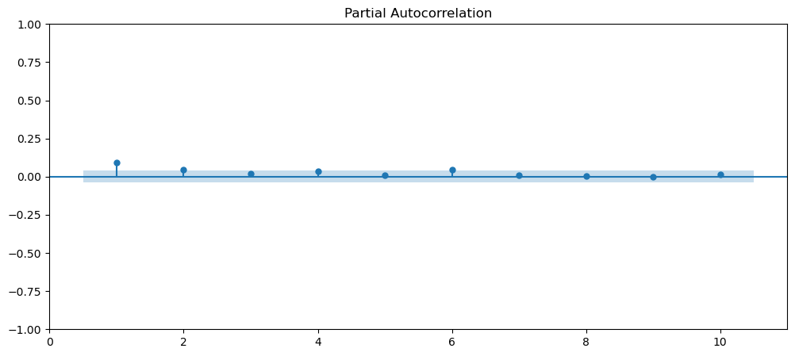

# Outline
1. Predict for SARIMA model
2. Predict for GARCH model
3. Homework 4 (the last one)


```python
import os
os.getcwd()
```


    '/home/jovyan'


```python
import pandas as pd
import numpy as np
import matplotlib.pyplot as plt
from statsmodels.graphics.tsaplots import plot_acf, plot_pacf
from statsmodels.tsa.statespace.tools import diff
from pathlib import Path
import warnings

warnings.filterwarnings('ignore')
```


```python
pip install arch
```

    Collecting arch
      Downloading arch-6.2.0-cp311-cp311-manylinux_2_17_x86_64.manylinux2014_x86_64.whl.metadata (13 kB)
    Requirement already satisfied: numpy>=1.19 in /opt/conda/lib/python3.11/site-packages (from arch) (1.24.4)
    Requirement already satisfied: scipy>=1.5 in /opt/conda/lib/python3.11/site-packages (from arch) (1.11.3)
    Requirement already satisfied: pandas>=1.1 in /opt/conda/lib/python3.11/site-packages (from arch) (2.1.1)
    Requirement already satisfied: statsmodels>=0.12 in /opt/conda/lib/python3.11/site-packages (from arch) (0.14.0)
    Requirement already satisfied: python-dateutil>=2.8.2 in /opt/conda/lib/python3.11/site-packages (from pandas>=1.1->arch) (2.8.2)
    Requirement already satisfied: pytz>=2020.1 in /opt/conda/lib/python3.11/site-packages (from pandas>=1.1->arch) (2023.3.post1)
    Requirement already satisfied: tzdata>=2022.1 in /opt/conda/lib/python3.11/site-packages (from pandas>=1.1->arch) (2023.3)
    Requirement already satisfied: patsy>=0.5.2 in /opt/conda/lib/python3.11/site-packages (from statsmodels>=0.12->arch) (0.5.3)
    Requirement already satisfied: packaging>=21.3 in /opt/conda/lib/python3.11/site-packages (from statsmodels>=0.12->arch) (23.2)
    Requirement already satisfied: six in /opt/conda/lib/python3.11/site-packages (from patsy>=0.5.2->statsmodels>=0.12->arch) (1.16.0)
    Downloading arch-6.2.0-cp311-cp311-manylinux_2_17_x86_64.manylinux2014_x86_64.whl (981 kB)
    [2K   [90m━━━━━━━━━━━━━━━━━━━━━━━━━━━━━━━━━━━━━━━━[0m [32m981.8/981.8 kB[0m [31m26.5 MB/s[0m eta [36m0:00:00[0m00:01[0m
    [?25hInstalling collected packages: arch
    Successfully installed arch-6.2.0
    Note: you may need to restart the kernel to use updated packages.


```python
pip install pmdarima
```

    Collecting pmdarima
      Downloading pmdarima-2.0.4-cp311-cp311-manylinux_2_17_x86_64.manylinux2014_x86_64.manylinux_2_28_x86_64.whl.metadata (7.8 kB)
    Requirement already satisfied: joblib>=0.11 in /opt/conda/lib/python3.11/site-packages (from pmdarima) (1.3.2)
    Requirement already satisfied: Cython!=0.29.18,!=0.29.31,>=0.29 in /opt/conda/lib/python3.11/site-packages (from pmdarima) (3.0.4)
    Requirement already satisfied: numpy>=1.21.2 in /opt/conda/lib/python3.11/site-packages (from pmdarima) (1.24.4)
    Requirement already satisfied: pandas>=0.19 in /opt/conda/lib/python3.11/site-packages (from pmdarima) (2.1.1)
    Requirement already satisfied: scikit-learn>=0.22 in /opt/conda/lib/python3.11/site-packages (from pmdarima) (1.3.1)
    Requirement already satisfied: scipy>=1.3.2 in /opt/conda/lib/python3.11/site-packages (from pmdarima) (1.11.3)
    Requirement already satisfied: statsmodels>=0.13.2 in /opt/conda/lib/python3.11/site-packages (from pmdarima) (0.14.0)
    Requirement already satisfied: urllib3 in /opt/conda/lib/python3.11/site-packages (from pmdarima) (2.0.7)
    Requirement already satisfied: setuptools!=50.0.0,>=38.6.0 in /opt/conda/lib/python3.11/site-packages (from pmdarima) (68.2.2)
    Requirement already satisfied: packaging>=17.1 in /opt/conda/lib/python3.11/site-packages (from pmdarima) (23.2)
    Requirement already satisfied: python-dateutil>=2.8.2 in /opt/conda/lib/python3.11/site-packages (from pandas>=0.19->pmdarima) (2.8.2)
    Requirement already satisfied: pytz>=2020.1 in /opt/conda/lib/python3.11/site-packages (from pandas>=0.19->pmdarima) (2023.3.post1)
    Requirement already satisfied: tzdata>=2022.1 in /opt/conda/lib/python3.11/site-packages (from pandas>=0.19->pmdarima) (2023.3)
    Requirement already satisfied: threadpoolctl>=2.0.0 in /opt/conda/lib/python3.11/site-packages (from scikit-learn>=0.22->pmdarima) (3.2.0)
    Requirement already satisfied: patsy>=0.5.2 in /opt/conda/lib/python3.11/site-packages (from statsmodels>=0.13.2->pmdarima) (0.5.3)
    Requirement already satisfied: six in /opt/conda/lib/python3.11/site-packages (from patsy>=0.5.2->statsmodels>=0.13.2->pmdarima) (1.16.0)
    Downloading pmdarima-2.0.4-cp311-cp311-manylinux_2_17_x86_64.manylinux2014_x86_64.manylinux_2_28_x86_64.whl (2.2 MB)
    [2K   [90m━━━━━━━━━━━━━━━━━━━━━━━━━━━━━━━━━━━━━━━━[0m [32m2.2/2.2 MB[0m [31m49.9 MB/s[0m eta [36m0:00:00[0m:00:01[0m
    [?25hInstalling collected packages: pmdarima
    Successfully installed pmdarima-2.0.4
    Note: you may need to restart the kernel to use updated packages.


```python
import matplotlib 
import statsmodels as sm
import arch
import pmdarima as pm # for auto.arima
```


```python
plt.rcParams["figure.figsize"] = [12, 5] 
```

# 1. Auto.arima

## Read data


```python
milk = pd.read_csv("milk_production.csv", 
                   index_col='month', 
                   parse_dates=True)
milk.head()
```


<div>
<style scoped>
    .dataframe tbody tr th:only-of-type {
        vertical-align: middle;
    }

    .dataframe tbody tr th {
        vertical-align: top;
    }

    .dataframe thead th {
        text-align: right;
    }
</style>
<table border="1" class="dataframe">
  <thead>
    <tr style="text-align: right;">
      <th></th>
      <th>production</th>
    </tr>
    <tr>
      <th>month</th>
      <th></th>
    </tr>
  </thead>
  <tbody>
    <tr>
      <th>1962-01-01</th>
      <td>589</td>
    </tr>
    <tr>
      <th>1962-02-01</th>
      <td>561</td>
    </tr>
    <tr>
      <th>1962-03-01</th>
      <td>640</td>
    </tr>
    <tr>
      <th>1962-04-01</th>
      <td>656</td>
    </tr>
    <tr>
      <th>1962-05-01</th>
      <td>727</td>
    </tr>
  </tbody>
</table>
</div>


```python
from sklearn.model_selection import train_test_split
milk_train, milk_test = train_test_split(milk, test_size=0.10, shuffle=False)
```


```python
milk_train.plot()
```


    <Axes: xlabel='month'>


    

    


## Auto.arima

auto.arima reference: https://alkaline-ml.com/pmdarima/modules/generated/pmdarima.arima.auto_arima.html


```python
auto_model = pm.auto_arima(milk_train, 
                           seasonal=True, 
                           m=12, 
                           test='adf',
                           stepwise=True)
auto_model.summary() 
```


<table class="simpletable">
<caption>SARIMAX Results</caption>
<tr>
  <th>Dep. Variable:</th>                  <td>y</td>               <th>  No. Observations:  </th>    <td>151</td>  
</tr>
<tr>
  <th>Model:</th>           <td>SARIMAX(0, 1, 1)x(0, 1, 1, 12)</td> <th>  Log Likelihood     </th> <td>-475.008</td>
</tr>
<tr>
  <th>Date:</th>                   <td>Tue, 05 Dec 2023</td>        <th>  AIC                </th>  <td>956.016</td>
</tr>
<tr>
  <th>Time:</th>                       <td>15:51:11</td>            <th>  BIC                </th>  <td>964.798</td>
</tr>
<tr>
  <th>Sample:</th>                    <td>01-01-1962</td>           <th>  HQIC               </th>  <td>959.585</td>
</tr>
<tr>
  <th></th>                          <td>- 07-01-1974</td>          <th>                     </th>     <td> </td>   
</tr>
<tr>
  <th>Covariance Type:</th>               <td>opg</td>              <th>                     </th>     <td> </td>   
</tr>
</table>
<table class="simpletable">
<tr>
      <td></td>        <th>coef</th>     <th>std err</th>      <th>z</th>      <th>P>|z|</th>  <th>[0.025</th>    <th>0.975]</th>  
</tr>
<tr>
  <th>ma.L1</th>    <td>   -0.2714</td> <td>    0.082</td> <td>   -3.326</td> <td> 0.001</td> <td>   -0.431</td> <td>   -0.111</td>
</tr>
<tr>
  <th>ma.S.L12</th> <td>   -0.6233</td> <td>    0.079</td> <td>   -7.908</td> <td> 0.000</td> <td>   -0.778</td> <td>   -0.469</td>
</tr>
<tr>
  <th>sigma2</th>   <td>   54.7638</td> <td>    5.498</td> <td>    9.960</td> <td> 0.000</td> <td>   43.987</td> <td>   65.540</td>
</tr>
</table>
<table class="simpletable">
<tr>
  <th>Ljung-Box (L1) (Q):</th>     <td>0.01</td> <th>  Jarque-Bera (JB):  </th> <td>31.78</td>
</tr>
<tr>
  <th>Prob(Q):</th>                <td>0.92</td> <th>  Prob(JB):          </th> <td>0.00</td> 
</tr>
<tr>
  <th>Heteroskedasticity (H):</th> <td>1.22</td> <th>  Skew:              </th> <td>0.74</td> 
</tr>
<tr>
  <th>Prob(H) (two-sided):</th>    <td>0.50</td> <th>  Kurtosis:          </th> <td>4.83</td> 
</tr>
</table><br/><br/>Warnings:<br/>[1] Covariance matrix calculated using the outer product of gradients (complex-step).


```python
auto_model.plot_diagnostics(figsize=(15,7)); plt.show()
```


    

    


```python
auto_model.resid()
```


    month
    1962-01-01    589.000000
    1962-02-01    -27.993923
    1962-03-01     78.999422
    1962-04-01     16.001630
    1962-05-01     71.000330
                     ...    
    1974-03-01      7.990257
    1974-04-01     -0.006136
    1974-05-01      6.067479
    1974-06-01      8.772492
    1974-07-01      6.562082
    Length: 151, dtype: float64


```python
plot_acf(auto_model.resid()[1:],zero=False)
plot_pacf(auto_model.resid()[1:],zero=False)
plt.show()
```


    

    


    

    


```python
from statsmodels.stats.diagnostic import acorr_ljungbox

acorr_ljungbox(auto_model.resid()[1:],lags=12) # looks all right
```


<div>
<style scoped>
    .dataframe tbody tr th:only-of-type {
        vertical-align: middle;
    }

    .dataframe tbody tr th {
        vertical-align: top;
    }

    .dataframe thead th {
        text-align: right;
    }
</style>
<table border="1" class="dataframe">
  <thead>
    <tr style="text-align: right;">
      <th></th>
      <th>lb_stat</th>
      <th>lb_pvalue</th>
    </tr>
  </thead>
  <tbody>
    <tr>
      <th>1</th>
      <td>0.300507</td>
      <td>0.583565</td>
    </tr>
    <tr>
      <th>2</th>
      <td>1.307248</td>
      <td>0.520157</td>
    </tr>
    <tr>
      <th>3</th>
      <td>3.136288</td>
      <td>0.371086</td>
    </tr>
    <tr>
      <th>4</th>
      <td>3.139091</td>
      <td>0.534825</td>
    </tr>
    <tr>
      <th>5</th>
      <td>3.809647</td>
      <td>0.577135</td>
    </tr>
    <tr>
      <th>6</th>
      <td>5.403001</td>
      <td>0.493257</td>
    </tr>
    <tr>
      <th>7</th>
      <td>7.519612</td>
      <td>0.376850</td>
    </tr>
    <tr>
      <th>8</th>
      <td>14.127277</td>
      <td>0.078508</td>
    </tr>
    <tr>
      <th>9</th>
      <td>14.148562</td>
      <td>0.117138</td>
    </tr>
    <tr>
      <th>10</th>
      <td>21.854844</td>
      <td>0.015861</td>
    </tr>
    <tr>
      <th>11</th>
      <td>22.286163</td>
      <td>0.022248</td>
    </tr>
    <tr>
      <th>12</th>
      <td>22.457200</td>
      <td>0.032704</td>
    </tr>
  </tbody>
</table>
</div>


## Predict


```python
test_pred = auto_model.predict(n_periods=milk_test.shape[0])
```


```python
index = milk_test.index

ax = milk_test.plot(style='--', alpha=0.6, figsize=(12,4))

pd.Series(test_pred, index=index).plot(style='-', ax=ax)

plt.legend(['test', 'forecast'])
plt.show()
```


    

    


```python
n = milk_test.shape[0]
forecast, conf_interval = auto_model.predict(n_periods=n, return_conf_int=True)
conf_interval
```


    array([[ 851.43076458,  880.43933497],
           [ 801.05212769,  836.94413901],
           [ 803.56791915,  845.22095981],
           [ 766.07435912,  812.7831925 ],
           [ 803.75763793,  855.02609251],
           [ 827.05529407,  882.50972114],
           [ 780.81694808,  840.16280577],
           [ 883.56858727,  946.56595365],
           [ 896.19840444,  962.64692221],
           [ 957.77522032, 1027.50428785],
           [ 929.76713829, 1002.62920114],
           [ 886.65900286,  962.52478927],
           [ 842.45533949,  924.81853094],
           [ 793.02394601,  880.37609157],
           [ 796.06074259,  888.13190725],
           [ 758.85074464,  855.41057785],
           [ 796.66929375,  897.51820756]])


```python
# zip(): Iterate over several iterables in parallel, producing tuples with an item from each one
lower_ci, upper_ci  = zip(*conf_interval)
lower_ci
```


    (851.4307645803995,
     801.0521276942462,
     803.5679191534422,
     766.0743591200586,
     803.7576379267977,
     827.0552940678152,
     780.8169480764119,
     883.5685872708909,
     896.1984044363485,
     957.775220321701,
     929.767138291107,
     886.6590028646549,
     842.455339490047,
     793.023946009006,
     796.0607425897216,
     758.8507446426822,
     796.6692937497595)


```python
index = milk_test.index

ax = milk_test.plot(style='--', alpha=0.6, figsize=(12,4))

pd.Series(forecast, index=index).plot(style='-', ax=ax)

plt.fill_between(index, lower_ci, upper_ci, alpha=0.2)

plt.legend(['milk_test', 'forecast'])
plt.show()
```


    

    


# 2. GARCH model
- Predict volatility in financial data
- Package reference: https://arch.readthedocs.io/en/latest/univariate/introduction.html

__GARCH(m,s) with drift__:
$$\begin{align*}
      R_t&=\mu+E_t\\
      E_t&=\sigma_t W_t\\
      \sigma_t^2&=\alpha_0+\sum_{i=1}^m\alpha_i R_{t-i}^2+\sum_{j=1}^s\beta_j \sigma_{t-j}^2
  \end{align*}$$


```python
from arch import arch_model
```


```python
msft = pd.read_csv('msft.csv', 
                   index_col='Date', 
                   parse_dates=True)
msft.head()
```


<div>
<style scoped>
    .dataframe tbody tr th:only-of-type {
        vertical-align: middle;
    }

    .dataframe tbody tr th {
        vertical-align: top;
    }

    .dataframe thead th {
        text-align: right;
    }
</style>
<table border="1" class="dataframe">
  <thead>
    <tr style="text-align: right;">
      <th></th>
      <th>close</th>
    </tr>
    <tr>
      <th>Date</th>
      <th></th>
    </tr>
  </thead>
  <tbody>
    <tr>
      <th>2010-01-04</th>
      <td>23.904985</td>
    </tr>
    <tr>
      <th>2010-01-05</th>
      <td>23.912710</td>
    </tr>
    <tr>
      <th>2010-01-06</th>
      <td>23.765955</td>
    </tr>
    <tr>
      <th>2010-01-07</th>
      <td>23.518789</td>
    </tr>
    <tr>
      <th>2010-01-08</th>
      <td>23.680998</td>
    </tr>
  </tbody>
</table>
</div>


```python
msft['returns'] = 100 * msft.pct_change()
msft.dropna(inplace=True, how='any')
msft.head()
```


<div>
<style scoped>
    .dataframe tbody tr th:only-of-type {
        vertical-align: middle;
    }

    .dataframe tbody tr th {
        vertical-align: top;
    }

    .dataframe thead th {
        text-align: right;
    }
</style>
<table border="1" class="dataframe">
  <thead>
    <tr style="text-align: right;">
      <th></th>
      <th>close</th>
      <th>returns</th>
    </tr>
    <tr>
      <th>Date</th>
      <th></th>
      <th></th>
    </tr>
  </thead>
  <tbody>
    <tr>
      <th>2010-01-05</th>
      <td>23.912710</td>
      <td>0.032314</td>
    </tr>
    <tr>
      <th>2010-01-06</th>
      <td>23.765955</td>
      <td>-0.613712</td>
    </tr>
    <tr>
      <th>2010-01-07</th>
      <td>23.518789</td>
      <td>-1.039999</td>
    </tr>
    <tr>
      <th>2010-01-08</th>
      <td>23.680998</td>
      <td>0.689698</td>
    </tr>
    <tr>
      <th>2010-01-11</th>
      <td>23.379765</td>
      <td>-1.272046</td>
    </tr>
  </tbody>
</table>
</div>


```python
msft.plot(subplots=True,  figsize=(15,8),
          title='Microsoft Daily Closing Price and Daily Returns')
```


    array([<Axes: xlabel='Date'>, <Axes: xlabel='Date'>], dtype=object)


    

    


__High-variance periods tend to cluster. GARCH can model this phenomenon.__


```python
msft_train, msft_test = train_test_split(msft['returns'], test_size=0.10, shuffle=False)
msft_train
```


    Date
    2010-01-05    0.032314
    2010-01-06   -0.613712
    2010-01-07   -1.039999
    2010-01-08    0.689698
    2010-01-11   -1.272046
                    ...   
    2019-11-19    0.033273
    2019-11-20   -0.173476
    2019-11-21   -0.093566
    2019-11-22    0.073577
    2019-11-25    1.096348
    Name: returns, Length: 2491, dtype: float64


```python
msft_train.plot()
```


    <Axes: xlabel='Date'>


    

    


__Which GARCH(p,q) model to fit?__

Check acf and pacf of $X_t^2$.


```python
plot_acf(msft_train**2,lags=10, zero=False)
plot_pacf(msft_train**2,lags=10, zero=False)
plt.show()
```


    

    


    

    


```python
model = arch_model(msft_train, 
                   p=1, q=1,
                   mean='Constant',
                   vol='GARCH',
                   dist='normal')

results = model.fit(update_freq=5)
```

    Iteration:      5,   Func. Count:     36,   Neg. LLF: 4374.845453710037
    Iteration:     10,   Func. Count:     62,   Neg. LLF: 4361.891627557763
    Optimization terminated successfully    (Exit mode 0)
                Current function value: 4361.891627557763
                Iterations: 11
                Function evaluations: 66
                Gradient evaluations: 11


```python
results.summary() # omega is the intercept in the condition variance equation
```


<table class="simpletable">
<caption>Constant Mean - GARCH Model Results</caption>
<tr>
  <th>Dep. Variable:</th>       <td>returns</td>      <th>  R-squared:         </th>  <td>   0.000</td> 
</tr>
<tr>
  <th>Mean Model:</th>       <td>Constant Mean</td>   <th>  Adj. R-squared:    </th>  <td>   0.000</td> 
</tr>
<tr>
  <th>Vol Model:</th>            <td>GARCH</td>       <th>  Log-Likelihood:    </th> <td>  -4361.89</td>
</tr>
<tr>
  <th>Distribution:</th>        <td>Normal</td>       <th>  AIC:               </th> <td>   8731.78</td>
</tr>
<tr>
  <th>Method:</th>        <td>Maximum Likelihood</td> <th>  BIC:               </th> <td>   8755.07</td>
</tr>
<tr>
  <th></th>                        <td></td>          <th>  No. Observations:  </th>    <td>2491</td>   
</tr>
<tr>
  <th>Date:</th>           <td>Tue, Dec 05 2023</td>  <th>  Df Residuals:      </th>    <td>2490</td>   
</tr>
<tr>
  <th>Time:</th>               <td>15:58:06</td>      <th>  Df Model:          </th>      <td>1</td>    
</tr>
</table>
<table class="simpletable">
<caption>Mean Model</caption>
<tr>
   <td></td>     <th>coef</th>     <th>std err</th>      <th>t</th>       <th>P>|t|</th>    <th>95.0% Conf. Int.</th>  
</tr>
<tr>
  <th>mu</th> <td>    0.1156</td> <td>2.702e-02</td> <td>    4.279</td> <td>1.877e-05</td> <td>[6.266e-02,  0.169]</td>
</tr>
</table>
<table class="simpletable">
<caption>Volatility Model</caption>
<tr>
      <td></td>        <th>coef</th>     <th>std err</th>      <th>t</th>       <th>P>|t|</th>    <th>95.0% Conf. Int.</th>  
</tr>
<tr>
  <th>omega</th>    <td>    0.3594</td> <td>    0.127</td> <td>    2.836</td> <td>4.574e-03</td>  <td>[  0.111,  0.608]</td> 
</tr>
<tr>
  <th>alpha[1]</th> <td>    0.1458</td> <td>4.424e-02</td> <td>    3.294</td> <td>9.861e-04</td> <td>[5.904e-02,  0.232]</td>
</tr>
<tr>
  <th>beta[1]</th>  <td>    0.6912</td> <td>8.177e-02</td> <td>    8.454</td> <td>2.821e-17</td>  <td>[  0.531,  0.852]</td> 
</tr>
</table><br/><br/>Covariance estimator: robust


```python
results.params # mu is the drift
```


    mu          0.115615
    omega       0.359402
    alpha[1]    0.145750
    beta[1]     0.691248
    Name: params, dtype: float64


```python
results.plot() # Top: 
plt.show()
```


    

    


- __Standardized residuals__: should be white noise if our model is correct

$$\frac{E_t}{\sigma_t}$$
  
- __Conditional volatility__: $\sigma_t$


```python
results.conditional_volatility.plot()
```


    <AxesSubplot:xlabel='Date'>


    

    


```python
acorr_ljungbox(results.std_resid)
```


<div>
<style scoped>
    .dataframe tbody tr th:only-of-type {
        vertical-align: middle;
    }

    .dataframe tbody tr th {
        vertical-align: top;
    }

    .dataframe thead th {
        text-align: right;
    }
</style>
<table border="1" class="dataframe">
  <thead>
    <tr style="text-align: right;">
      <th></th>
      <th>lb_stat</th>
      <th>lb_pvalue</th>
    </tr>
  </thead>
  <tbody>
    <tr>
      <th>1</th>
      <td>0.718852</td>
      <td>0.396521</td>
    </tr>
    <tr>
      <th>2</th>
      <td>1.268411</td>
      <td>0.530357</td>
    </tr>
    <tr>
      <th>3</th>
      <td>1.272572</td>
      <td>0.735656</td>
    </tr>
    <tr>
      <th>4</th>
      <td>3.527163</td>
      <td>0.473760</td>
    </tr>
    <tr>
      <th>5</th>
      <td>9.582471</td>
      <td>0.087968</td>
    </tr>
    <tr>
      <th>6</th>
      <td>11.622693</td>
      <td>0.070935</td>
    </tr>
    <tr>
      <th>7</th>
      <td>11.729982</td>
      <td>0.109796</td>
    </tr>
    <tr>
      <th>8</th>
      <td>18.580377</td>
      <td>0.017272</td>
    </tr>
    <tr>
      <th>9</th>
      <td>19.017882</td>
      <td>0.025041</td>
    </tr>
    <tr>
      <th>10</th>
      <td>20.895613</td>
      <td>0.021833</td>
    </tr>
  </tbody>
</table>
</div>


```python
msft_test.shape[0]
```


    277


```python
test_predict = results.forecast(horizon=msft_test.shape[0]) # horizon: how many steps ahead forecasting
```


```python
help(test_predict)
```

    Help on ARCHModelForecast in module arch.univariate.base object:
    
    class ARCHModelForecast(builtins.object)
     |  ARCHModelForecast(index: 'Union[List[Label], pd.Index]', start_index: 'int', mean: 'Float64Array', variance: 'Float64Array', residual_variance: 'Float64Array', simulated_paths: 'Optional[Float64Array]' = None, simulated_variances: 'Optional[Float64Array]' = None, simulated_residual_variances: 'Optional[Float64Array]' = None, simulated_residuals: 'Optional[Float64Array]' = None, align: "Literal['origin', 'target']" = 'origin', *, reindex: 'bool' = False) -> 'None'
     |  
     |  Container for forecasts from an ARCH Model
     |  
     |  Parameters
     |  ----------
     |  index : {list, ndarray}
     |  mean : ndarray
     |  variance : ndarray
     |  residual_variance : ndarray
     |  simulated_paths : ndarray, optional
     |  simulated_variances : ndarray, optional
     |  simulated_residual_variances : ndarray, optional
     |  simulated_residuals : ndarray, optional
     |  align : {'origin', 'target'}
     |  
     |  Methods defined here:
     |  
     |  __init__(self, index: 'Union[List[Label], pd.Index]', start_index: 'int', mean: 'Float64Array', variance: 'Float64Array', residual_variance: 'Float64Array', simulated_paths: 'Optional[Float64Array]' = None, simulated_variances: 'Optional[Float64Array]' = None, simulated_residual_variances: 'Optional[Float64Array]' = None, simulated_residuals: 'Optional[Float64Array]' = None, align: "Literal['origin', 'target']" = 'origin', *, reindex: 'bool' = False) -> 'None'
     |      Initialize self.  See help(type(self)) for accurate signature.
     |  
     |  ----------------------------------------------------------------------
     |  Readonly properties defined here:
     |  
     |  mean
     |      Forecast values for the conditional mean of the process
     |  
     |  residual_variance
     |      Forecast values for the conditional variance of the residuals
     |  
     |  simulations
     |      Detailed simulation results if using a simulation-based method
     |      
     |      Returns
     |      -------
     |      ARCHModelForecastSimulation
     |          Container for simulation results
     |  
     |  variance
     |      Forecast values for the conditional variance of the process
     |  
     |  ----------------------------------------------------------------------
     |  Data descriptors defined here:
     |  
     |  __dict__
     |      dictionary for instance variables (if defined)
     |  
     |  __weakref__
     |      list of weak references to the object (if defined)
    


```python
msft_test.head()
```


    Date
    2019-11-26    0.528986
    2019-11-27    0.190753
    2019-11-29   -0.617108
    2019-12-02   -1.208886
    2019-12-03   -0.160488
    Name: returns, dtype: float64


```python
test_predict.mean
```


<div>
<style scoped>
    .dataframe tbody tr th:only-of-type {
        vertical-align: middle;
    }

    .dataframe tbody tr th {
        vertical-align: top;
    }

    .dataframe thead th {
        text-align: right;
    }
</style>
<table border="1" class="dataframe">
  <thead>
    <tr style="text-align: right;">
      <th></th>
      <th>h.001</th>
      <th>h.002</th>
      <th>h.003</th>
      <th>h.004</th>
      <th>h.005</th>
      <th>h.006</th>
      <th>h.007</th>
      <th>h.008</th>
      <th>h.009</th>
      <th>h.010</th>
      <th>...</th>
      <th>h.268</th>
      <th>h.269</th>
      <th>h.270</th>
      <th>h.271</th>
      <th>h.272</th>
      <th>h.273</th>
      <th>h.274</th>
      <th>h.275</th>
      <th>h.276</th>
      <th>h.277</th>
    </tr>
    <tr>
      <th>Date</th>
      <th></th>
      <th></th>
      <th></th>
      <th></th>
      <th></th>
      <th></th>
      <th></th>
      <th></th>
      <th></th>
      <th></th>
      <th></th>
      <th></th>
      <th></th>
      <th></th>
      <th></th>
      <th></th>
      <th></th>
      <th></th>
      <th></th>
      <th></th>
      <th></th>
    </tr>
  </thead>
  <tbody>
    <tr>
      <th>2019-11-25</th>
      <td>0.115615</td>
      <td>0.115615</td>
      <td>0.115615</td>
      <td>0.115615</td>
      <td>0.115615</td>
      <td>0.115615</td>
      <td>0.115615</td>
      <td>0.115615</td>
      <td>0.115615</td>
      <td>0.115615</td>
      <td>...</td>
      <td>0.115615</td>
      <td>0.115615</td>
      <td>0.115615</td>
      <td>0.115615</td>
      <td>0.115615</td>
      <td>0.115615</td>
      <td>0.115615</td>
      <td>0.115615</td>
      <td>0.115615</td>
      <td>0.115615</td>
    </tr>
  </tbody>
</table>
<p>1 rows × 277 columns</p>
</div>


```python
pp = test_predict.mean.values
pred_r = pd.Series(pp.ravel(), index=msft_test.index)
pred_r.plot()
msft_test.plot()
```


    <Axes: xlabel='Date'>


    

    


```python
vv = test_predict.variance.values
pred_var = pd.Series(vv.ravel(), index=msft_test.index)
pred_var.plot()
```


    <Axes: xlabel='Date'>


    

    


```python
pd.DataFrame({"return":pred_r, "variance": pred_var})
```


<div>
<style scoped>
    .dataframe tbody tr th:only-of-type {
        vertical-align: middle;
    }

    .dataframe tbody tr th {
        vertical-align: top;
    }

    .dataframe thead th {
        text-align: right;
    }
</style>
<table border="1" class="dataframe">
  <thead>
    <tr style="text-align: right;">
      <th></th>
      <th>return</th>
      <th>variance</th>
    </tr>
    <tr>
      <th>Date</th>
      <th></th>
      <th></th>
    </tr>
  </thead>
  <tbody>
    <tr>
      <th>2019-11-26</th>
      <td>0.115615</td>
      <td>1.341888</td>
    </tr>
    <tr>
      <th>2019-11-27</th>
      <td>0.115615</td>
      <td>1.482559</td>
    </tr>
    <tr>
      <th>2019-11-29</th>
      <td>0.115615</td>
      <td>1.600301</td>
    </tr>
    <tr>
      <th>2019-12-02</th>
      <td>0.115615</td>
      <td>1.698850</td>
    </tr>
    <tr>
      <th>2019-12-03</th>
      <td>0.115615</td>
      <td>1.781336</td>
    </tr>
    <tr>
      <th>...</th>
      <td>...</td>
      <td>...</td>
    </tr>
    <tr>
      <th>2020-12-24</th>
      <td>0.115615</td>
      <td>2.204893</td>
    </tr>
    <tr>
      <th>2020-12-28</th>
      <td>0.115615</td>
      <td>2.204893</td>
    </tr>
    <tr>
      <th>2020-12-29</th>
      <td>0.115615</td>
      <td>2.204893</td>
    </tr>
    <tr>
      <th>2020-12-30</th>
      <td>0.115615</td>
      <td>2.204893</td>
    </tr>
    <tr>
      <th>2020-12-31</th>
      <td>0.115615</td>
      <td>2.204893</td>
    </tr>
  </tbody>
</table>
<p>277 rows × 2 columns</p>
</div>


### Question
If you have \\$1000 worth of MSFT stocks at the end of 2019-11-25, what is $VaR_{5\%}$ of this portfolio at the end of 2019-11-26?


```python
from scipy.stats import norm
```


```python
norm.ppf(0.05, loc=0.1156, scale=1.341889**0.5)/100*1000
# there is 5% chance that you will lose 17 dollars or more on this day you predict
```


    -17.89797333910343


## Homework 4: Repeat the GARCH experiment
- **Practice; No due date; Not graded**
- Use the stock price you obtained from the first homework assignment
  - Use "Close" (i.e., closing price) to calculate return
- Fit a Garch model to Return series
  - Decide the lags yourself
- Predict variance for the test data
- Compute the $VaR_{5\%}$ of your current \\$1000 worth of stocks in the next day

__Intall package for collecting financial data__

Package reference: https://github.com/ranaroussi/yfinance


```python
pip install yfinance
```

    Collecting yfinance
      Downloading yfinance-0.2.17-py2.py3-none-any.whl (60 kB)
    [2K     [90m━━━━━━━━━━━━━━━━━━━━━━━━━━━━━━━━━━━━━━━━[0m [32m60.3/60.3 kB[0m [31m1.2 MB/s[0m eta [36m0:00:00[0ma [36m0:00:01[0m
    [?25hRequirement already satisfied: appdirs>=1.4.4 in /Users/yutingyuan/opt/anaconda3/lib/python3.9/site-packages (from yfinance) (1.4.4)
    Collecting html5lib>=1.1
      Downloading html5lib-1.1-py2.py3-none-any.whl (112 kB)
    [2K     [90m━━━━━━━━━━━━━━━━━━━━━━━━━━━━━━━━━━━━━━━[0m [32m112.2/112.2 kB[0m [31m2.6 MB/s[0m eta [36m0:00:00[0ma [36m0:00:01[0m
    [?25hRequirement already satisfied: numpy>=1.16.5 in /Users/yutingyuan/opt/anaconda3/lib/python3.9/site-packages (from yfinance) (1.21.5)
    Collecting frozendict>=2.3.4
      Downloading frozendict-2.3.7-cp39-cp39-macosx_10_9_x86_64.whl (35 kB)
    Collecting lxml>=4.9.1
      Downloading lxml-4.9.2-cp39-cp39-macosx_10_15_x86_64.whl (4.8 MB)
    [2K     [90m━━━━━━━━━━━━━━━━━━━━━━━━━━━━━━━━━━━━━━━━[0m [32m4.8/4.8 MB[0m [31m19.1 MB/s[0m eta [36m0:00:00[0m00:01[0m00:01[0m
    [?25hRequirement already satisfied: pandas>=1.3.0 in /Users/yutingyuan/opt/anaconda3/lib/python3.9/site-packages (from yfinance) (1.4.2)
    Collecting multitasking>=0.0.7
      Downloading multitasking-0.0.11-py3-none-any.whl (8.5 kB)
    Requirement already satisfied: beautifulsoup4>=4.11.1 in /Users/yutingyuan/opt/anaconda3/lib/python3.9/site-packages (from yfinance) (4.11.1)
    Requirement already satisfied: requests>=2.26 in /Users/yutingyuan/opt/anaconda3/lib/python3.9/site-packages (from yfinance) (2.27.1)
    Collecting pytz>=2022.5
      Downloading pytz-2023.3-py2.py3-none-any.whl (502 kB)
    [2K     [90m━━━━━━━━━━━━━━━━━━━━━━━━━━━━━━━━━━━━━━[0m [32m502.3/502.3 kB[0m [31m12.1 MB/s[0m eta [36m0:00:00[0m00:01[0m
    [?25hRequirement already satisfied: cryptography>=3.3.2 in /Users/yutingyuan/opt/anaconda3/lib/python3.9/site-packages (from yfinance) (3.4.8)
    Requirement already satisfied: soupsieve>1.2 in /Users/yutingyuan/opt/anaconda3/lib/python3.9/site-packages (from beautifulsoup4>=4.11.1->yfinance) (2.3.1)
    Requirement already satisfied: cffi>=1.12 in /Users/yutingyuan/opt/anaconda3/lib/python3.9/site-packages (from cryptography>=3.3.2->yfinance) (1.15.0)
    Requirement already satisfied: webencodings in /Users/yutingyuan/opt/anaconda3/lib/python3.9/site-packages (from html5lib>=1.1->yfinance) (0.5.1)
    Requirement already satisfied: six>=1.9 in /Users/yutingyuan/opt/anaconda3/lib/python3.9/site-packages (from html5lib>=1.1->yfinance) (1.16.0)
    Requirement already satisfied: python-dateutil>=2.8.1 in /Users/yutingyuan/opt/anaconda3/lib/python3.9/site-packages (from pandas>=1.3.0->yfinance) (2.8.2)
    Requirement already satisfied: certifi>=2017.4.17 in /Users/yutingyuan/opt/anaconda3/lib/python3.9/site-packages (from requests>=2.26->yfinance) (2022.12.7)
    Requirement already satisfied: idna<4,>=2.5 in /Users/yutingyuan/opt/anaconda3/lib/python3.9/site-packages (from requests>=2.26->yfinance) (3.3)
    Requirement already satisfied: charset-normalizer~=2.0.0 in /Users/yutingyuan/opt/anaconda3/lib/python3.9/site-packages (from requests>=2.26->yfinance) (2.0.4)
    Requirement already satisfied: urllib3<1.27,>=1.21.1 in /Users/yutingyuan/opt/anaconda3/lib/python3.9/site-packages (from requests>=2.26->yfinance) (1.26.9)
    Requirement already satisfied: pycparser in /Users/yutingyuan/opt/anaconda3/lib/python3.9/site-packages (from cffi>=1.12->cryptography>=3.3.2->yfinance) (2.21)
    Installing collected packages: pytz, multitasking, lxml, html5lib, frozendict, yfinance
      Attempting uninstall: pytz
        Found existing installation: pytz 2021.3
        Uninstalling pytz-2021.3:
          Successfully uninstalled pytz-2021.3
      Attempting uninstall: lxml
        Found existing installation: lxml 4.8.0
        Uninstalling lxml-4.8.0:
          Successfully uninstalled lxml-4.8.0
    [31mERROR: pip's dependency resolver does not currently take into account all the packages that are installed. This behaviour is the source of the following dependency conflicts.
    conda-repo-cli 1.0.4 requires pathlib, which is not installed.[0m[31m
    [0mSuccessfully installed frozendict-2.3.7 html5lib-1.1 lxml-4.9.2 multitasking-0.0.11 pytz-2023.3 yfinance-0.2.17
    Note: you may need to restart the kernel to use updated packages.


```python
# Code for obtaining stock price data
import yfinance as yf
```


```python
aapl = yf.Ticker("AAPL")
```


```python
data = yf.download("AAPL", start="2017-01-01", end="2017-04-30")
data.head()
```

    [*********************100%***********************]  1 of 1 completed


<div>
<style scoped>
    .dataframe tbody tr th:only-of-type {
        vertical-align: middle;
    }

    .dataframe tbody tr th {
        vertical-align: top;
    }

    .dataframe thead th {
        text-align: right;
    }
</style>
<table border="1" class="dataframe">
  <thead>
    <tr style="text-align: right;">
      <th></th>
      <th>Open</th>
      <th>High</th>
      <th>Low</th>
      <th>Close</th>
      <th>Adj Close</th>
      <th>Volume</th>
    </tr>
    <tr>
      <th>Date</th>
      <th></th>
      <th></th>
      <th></th>
      <th></th>
      <th></th>
      <th></th>
    </tr>
  </thead>
  <tbody>
    <tr>
      <th>2017-01-03</th>
      <td>28.950001</td>
      <td>29.082500</td>
      <td>28.690001</td>
      <td>29.037500</td>
      <td>27.133326</td>
      <td>115127600</td>
    </tr>
    <tr>
      <th>2017-01-04</th>
      <td>28.962500</td>
      <td>29.127501</td>
      <td>28.937500</td>
      <td>29.004999</td>
      <td>27.102959</td>
      <td>84472400</td>
    </tr>
    <tr>
      <th>2017-01-05</th>
      <td>28.980000</td>
      <td>29.215000</td>
      <td>28.952499</td>
      <td>29.152500</td>
      <td>27.240786</td>
      <td>88774400</td>
    </tr>
    <tr>
      <th>2017-01-06</th>
      <td>29.195000</td>
      <td>29.540001</td>
      <td>29.117500</td>
      <td>29.477501</td>
      <td>27.544476</td>
      <td>127007600</td>
    </tr>
    <tr>
      <th>2017-01-09</th>
      <td>29.487499</td>
      <td>29.857500</td>
      <td>29.485001</td>
      <td>29.747499</td>
      <td>27.796770</td>
      <td>134247600</td>
    </tr>
  </tbody>
</table>
</div>


```python
data['Close'].plot()
```


    <AxesSubplot:xlabel='Date'>


    

    


```python
data = data[['Close']]
data.head()
```


<div>
<style scoped>
    .dataframe tbody tr th:only-of-type {
        vertical-align: middle;
    }

    .dataframe tbody tr th {
        vertical-align: top;
    }

    .dataframe thead th {
        text-align: right;
    }
</style>
<table border="1" class="dataframe">
  <thead>
    <tr style="text-align: right;">
      <th></th>
      <th>Close</th>
    </tr>
    <tr>
      <th>Date</th>
      <th></th>
    </tr>
  </thead>
  <tbody>
    <tr>
      <th>2017-01-03</th>
      <td>29.037500</td>
    </tr>
    <tr>
      <th>2017-01-04</th>
      <td>29.004999</td>
    </tr>
    <tr>
      <th>2017-01-05</th>
      <td>29.152500</td>
    </tr>
    <tr>
      <th>2017-01-06</th>
      <td>29.477501</td>
    </tr>
    <tr>
      <th>2017-01-09</th>
      <td>29.747499</td>
    </tr>
  </tbody>
</table>
</div>


```python

```
